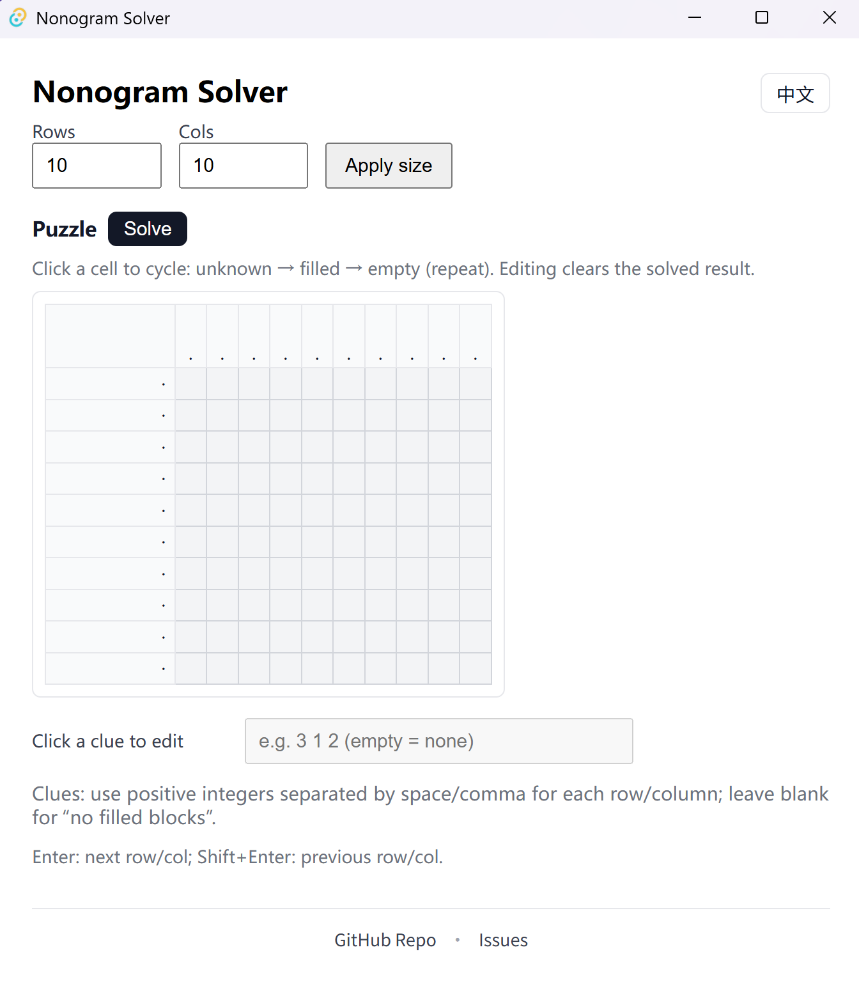
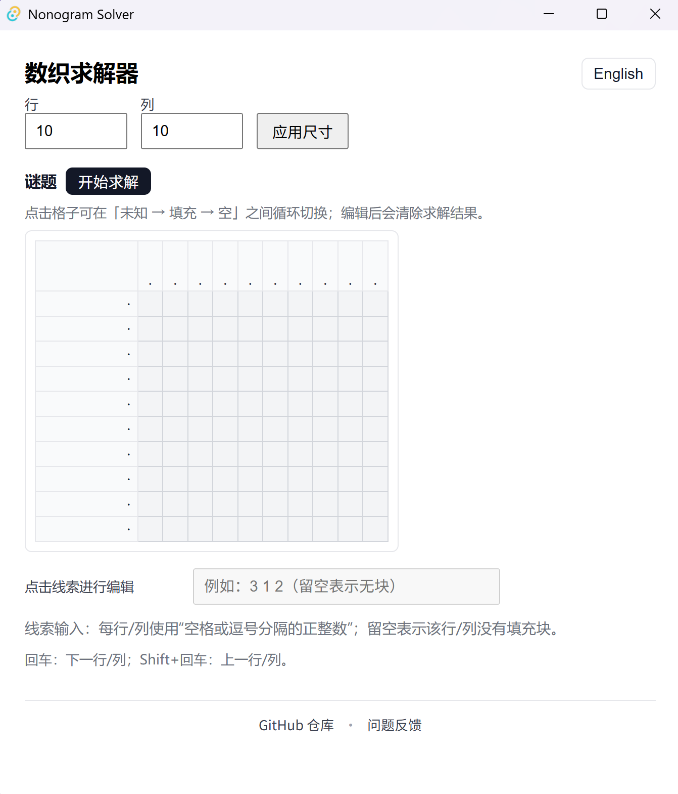

# nonogram_solver

[English](#english) | [中文](#中文说明)

## English

Nonogram (Picross) solver implemented in Rust, with a desktop GUI built on **Tauri + Vite**.

> Goal: keep the solving algorithm as a reusable Rust crate, and provide a convenient desktop experience.

---

## Features

- Solve Nonogram puzzles (powered by the `solver-core` algorithm)
- Tauri desktop GUI (interactive use)

### GUI preview



---

## Repository layout

- `crates/solver-core/`: core solver library (Rust)
  - `src/lib.rs`: public API
  - `src/solver.rs`: main solver implementation
- `src/`: frontend (Vite/TypeScript) used by the Tauri GUI
- `src-tauri/`: Tauri backend (Rust) and bundling configuration

---

## Requirements

- Rust
- Node.js

---

## Quick start

### 1) Install frontend dependencies

```bash
npm install
```

### 2) Run the GUI (dev)

```bash
cargo tauri dev
```

### 3) Build the GUI (release)

Prefer `--no-bundle`: it produces a portable executable (no installer).

```bash
npm run build
cargo tauri build --no-bundle
```

> `npm run build` builds the frontend assets; `cargo tauri build --no-bundle` produces the executable under `target/release/`.

If you need an installer (NSIS/MSI, etc.), use:

```bash
cargo tauri build
```

---

## License

MIT License (see [LICENSE](LICENSE)).

---

## 中文说明

一个用于求解 **数织 / Nonogram（Picross** 的项目，核心求解逻辑使用 Rust 实现，并提供基于 **Tauri + Vite** 的桌面 GUI。

> 目标：把求解算法做成可复用的 Rust crate，并提供便捷的桌面端交互体验。

---

## 功能概览

- Nonogram 题目求解（基于 `solver-core` 的核心算法）
- Tauri 桌面 GUI（适合交互式使用）

### GUI 界面预览



---

## 仓库结构

- `crates/solver-core/`：核心求解库（Rust）
  - `src/lib.rs`：对外 API
  - `src/solver.rs`：主要求解实现
- `src/`：前端（Vite/TypeScript），供 Tauri GUI 使用
- `src-tauri/`：Tauri 后端（Rust）与打包配置

---

## 环境要求

- Rust
- Node.js

---

## 快速开始

### 1) 安装前端依赖

```bash
npm install
```

### 2) 运行 GUI（开发模式）

```bash
cargo tauri dev
```

### 3) 构建 GUI（发布包）

推荐优先使用 `--no-bundle`：生成可直接分发的可执行文件（便携式），不生成安装包。

```bash
npm run build
cargo tauri build --no-bundle
```

> `npm run build` 负责构建前端静态资源；`cargo tauri build --no-bundle` 会在 `target/release/` 生成可执行文件。

如需生成安装包（NSIS/MSI 等），再使用：

```bash
cargo tauri build
```

---

## 许可证

MIT License（见 [LICENSE](LICENSE)）。
